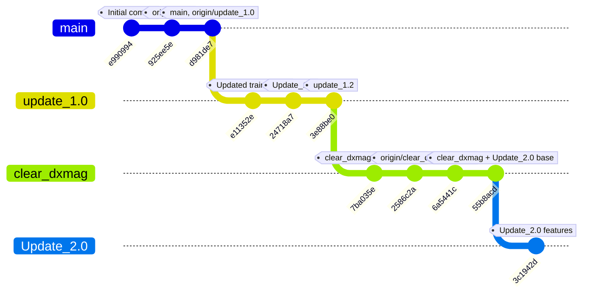

# clear_dxmag

Files required for `predict_cif_dxmag.py`:
- `predict_cif_dxmag.py`
- `magmom_model_dxmag.pkl`
- `cif/` directory with input `.cif` files

Run:
```bash
python predict_cif_dxmag.py --cif-dir cif --model-file magmom_model_dxmag.pkl
```

Outputs:
- `predicted_dxmag.csv` - successful predictions
- `prediction_errors_dxmag.csv` - files that failed with error details

## Git History


